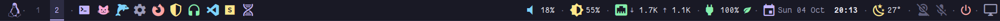
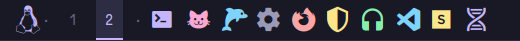
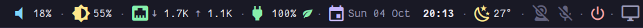
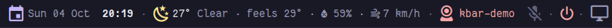
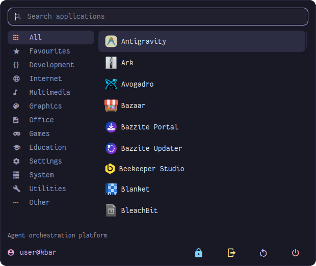
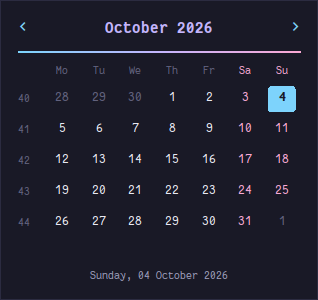
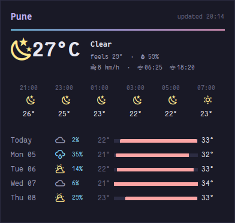
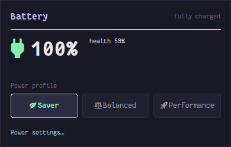
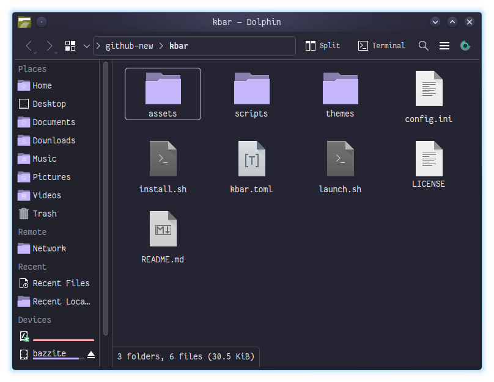
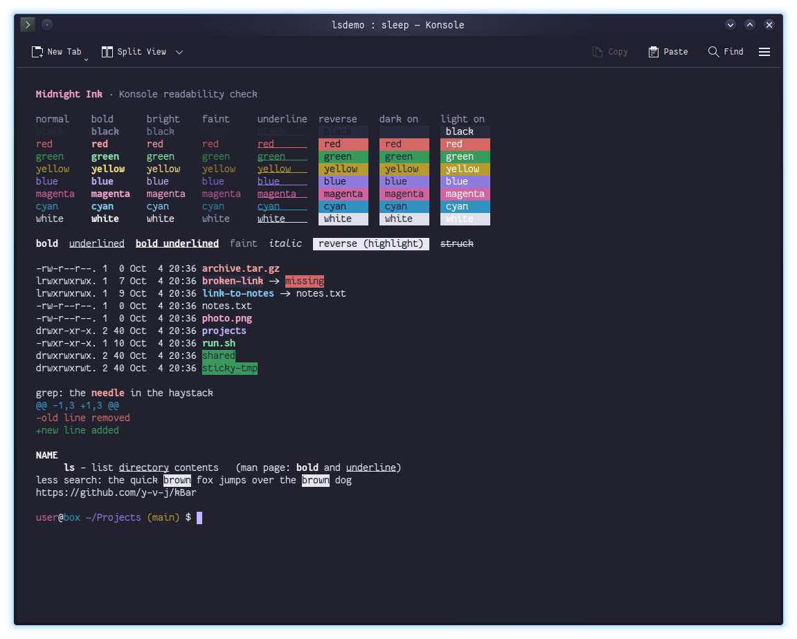

# kBar

A [polybar](https://github.com/polybar/polybar) for KDE Plasma. It runs across the top of the screen with an application menu, launchers, KDE virtual desktops and a full set of status widgets, and every part of it responds to the mouse. It shares its "Midnight Ink" look with [pySysMon](https://github.com/y-v-j/pySysMon), [pyQuotes](https://github.com/y-v-j/pyQuotes) and [pyReader](https://github.com/y-v-j/pyReader), and comes with [matching themes for Dolphin and Konsole](#matching-themes-for-dolphin-and-konsole).

<p align="center">
  
</p>


-191926?style=flat-square&logo=kde&logoColor=white)


## Screenshots

The left end: the application menu button, virtual desktops and launchers.

<p align="center"></p>

The right end: volume, brightness, network, battery and power profile, date and time, weather, camera and microphone, power and show desktop.

<p align="center"></p>

Click a widget for more. Here the weather shows its details, and the camera indicator has turned coral because a program (`kbar-demo`) has a camera open:

<p align="center"></p>

The application menu opens under the Tux icon. Type to search; the corner shows `user@host` or a label of your choice (`user@kbar` here).

<p align="center"></p>

Popups for the calendar, the forecast, and the battery with its power profiles:

<p align="center">
  
  
  
</p>

## Features

- **Application menu:** search as you type, browse by category, start apps with the mouse or the keyboard. *Favourites* lists the apps on the bar. Buttons lock the screen, log out, restart or shut down (KDE asks first).
- **Launchers from a TOML file:** add an app by adding a few lines to `kbar.toml`; the bar rebuilds itself when you save. Right and middle clicks can run their own commands (a private window, a new window, a folder…). Apps that aren't installed are left out.
- **KDE virtual desktops:** click a desktop to switch, scroll to cycle, right-click for Overview, middle-click for Grid View.
- **Volume:** mute, scroll to change, middle-click to switch output device.
- **Brightness:** works for laptop screens *and* external monitors (through KDE, over DDC/CI). Click to toggle Night Light; a moon shows while it's on.
- **Network:** Ethernet and Wi-Fi with live transfer rates; click for the IP address, middle-click to turn Wi-Fi on or off.
- **Battery with options:** level, charging state and the active power profile. The popup shows time left, power draw, battery health and charge limit, and switches between Power saver, Balanced and Performance.
- **Date and time:** click for the long format, right-click for the calendar.
- **Weather:** from [Open-Meteo](https://open-meteo.com) (free, no API key), for a place you choose or located by IP address. Click for details, right-click for the hourly and five-day forecast.
- **Camera and microphone indicator:** the camera turns coral and names the program while one is using it; the microphone shows when it's muted or recording and mutes on a click.
- **Power menu and show desktop** at the far right.
- **One detail at a time:** opening one widget's details folds away any other, so the bar never runs out of room.
- **Light on resources:** each widget is a small Python script (standard library only) that redraws on D-Bus signals, PulseAudio events and inotify instead of polling where it can. The whole bar, polybar included, uses under 1% of one CPU core.
- **Apps outlive the bar:** everything started from kBar runs in its own systemd scope, so restarting the bar never closes your windows.
- **Matching Dolphin and Konsole:** optional Midnight Ink themes for the file manager and the terminal, applied to those two apps only.

## Requirements

| Requirement | Notes |
|---|---|
| KDE Plasma 6 | Wayland (through XWayland) or X11 |
| polybar 3.6+ | Fedora / Bazzite: `rpm-ostree install polybar`; Arch: `pacman -S polybar` |
| Python 3.11+ at `/usr/bin/python3` | For the widget scripts (standard library only) |
| A Python with Tk and PySide6 | For the application menu and popups; a Tk built with Xft gives smooth text. The installer looks for one (e.g. the `conky-env` conda env used by pySysMon and pyReader) |
| [FantasqueSansM Nerd Font](https://www.nerdfonts.com/) | Installed by `install.sh` if missing |
| `busctl`, `gdbus`, `pactl`, `nmcli`, `kstart` | Standard on Plasma systems with systemd, PipeWire and NetworkManager |

## Installation

```bash
git clone https://github.com/y-v-j/kBar.git
cd kBar
./install.sh
```

The installer copies the bar to `~/.config/kbar`, starts it as the `kbar` systemd user service, and adds it to autostart.

```
./install.sh [--startup autostart|none] [--python PATH] [--no-start] [--uninstall]

  --startup MODE   How to start at login: autostart (default) or none
  --python PATH    Python for the application menu and popups (Tk + PySide6)
  --no-start       Don't start the bar after installing
  --uninstall      Remove kBar (keeps kbar.toml and the font)
```

Day to day:

```bash
~/.config/kbar/launch.sh            # start or restart
systemctl --user stop kbar          # stop
journalctl --user -u kbar           # logs
```

## Mouse controls

| Item | Left click | Right click | Middle click | Scroll |
|---|---|---|---|---|
| Tux | Application menu | KRunner | Overview | |
| Desktops | Switch to that desktop | Overview | Grid View | Next / previous desktop |
| Launchers | Start the app | Its `right` command | Its `middle` command | |
| Volume | Mute | Audio settings | Next output device | Volume |
| Brightness | Night Light on/off | Display settings | Night Light settings | Brightness |
| Network | Show the IP address | Network settings | Wi-Fi on/off | |
| Battery | Battery popup and power profiles | Power settings | | |
| Date & time | Long format | Calendar | | |
| Weather | Details | Forecast | Refresh now | |
| Camera | Who is using it | Audio settings | | |
| Microphone | Mute / unmute | Audio settings | | |
| Power | Lock, log out, restart, shut down (KDE asks first) | Lock now | | |
| Show desktop | Show the desktop | Overview | | |

In the menu, type to search, use the arrows and Enter to start an app, and Esc or a click elsewhere to close it. In the calendar, scroll or use the arrows to change month and click the date at the bottom to return to today. Popups close with Esc, a right click, moving the pointer away, or clicking the bar item again.

## Configuration

`~/.config/kbar/kbar.toml` holds the settings you're likely to change. Save it and the bar picks up the change within a second or two; `install.sh` never overwrites it.

```toml
[[launcher]]
name = "Firefox"
icon = "󰈹"                      # a Nerd Font glyph: https://www.nerdfonts.com/cheat-sheet
color = "coral"                  # sky, lavender, rose, mint, butter, coral, fg, label, dim or "#rrggbb"
desktop = "org.mozilla.firefox"  # left click starts this .desktop file...
# command = "firefox"            # ...or runs this command instead
right = "flatpak run org.mozilla.firefox --private-window"   # optional
# middle = "..."                                             # optional

[weather]
location = ""            # a place ("Lisbon"), "lat,lon", or "" to locate by IP address
units = "metric"         # or "imperial"
refresh_minutes = 15

[desktops]
labels = []              # optional names or glyphs for the desktops

[menu]
user_label = ""          # text in the menu's corner; "" shows user@hostname
```

`~/.config/kbar/config.ini` is the polybar config itself: the colours (`[colors]`), fonts, height and position (`[bar/kbar]`), and which widgets appear where. polybar reloads it when you save it. Re-running `install.sh` replaces it, so keep a copy of your changes.

## Working with the desktop widgets

[pySysMon](https://github.com/y-v-j/pySysMon), [pyQuotes](https://github.com/y-v-j/pyQuotes) and [pyReader](https://github.com/y-v-j/pyReader) read the space kBar reserves and keep below it, and they move back up if the bar stops.

## Matching themes for Dolphin and Konsole

`themes/` gives Dolphin and Konsole the same look as the bar and the widgets: the Midnight Ink colours, FantasqueSansM Nerd Font and 96% opacity. Only these two apps change; the rest of Plasma keeps its colour scheme, icons and accent. Menus, toolbars, shortcuts and behaviour stay as they were.

<p align="center">
  
</p>
<p align="center">
  
</p>

```bash
themes/install.sh                     # Dolphin, Konsole and readable ls colours
themes/install.sh --terminal-button   # ...plus a Terminal on/off button in Dolphin's toolbar
themes/install.sh --uninstall         # put back what was there before
```

Options `--no-dolphin`, `--no-konsole` and `--no-ls` skip a part. Restart Dolphin and Konsole afterwards.

**Dolphin**

- A KDE colour scheme (`MidnightInk.colors`): card-coloured title bar and toolbar, the background colour for the side panels, a slightly lighter file view, and lavender for selection, focus and hover. Selected files are lavender with dark text, like *today* in the calendar popup.
- Lavender folders. Breeze tints folders with the Plasma accent, which a per-app scheme can't change, so `make-icon-theme.py` builds a small icon theme from your installed Breeze Dark with the lavender baked in, and Dolphin alone uses it.
- FantasqueSansM Nerd Font for the icon, compact and details views. Menus, toolbar, panels and the status bar use Plasma's fonts (*System Settings > Text & Fonts*).
- 96% opacity through a KWin window rule (`kbar-midnight-ink-dolphin`), like the widgets.
- With `--terminal-button`, a **Terminal** button next to Split shows or hides Dolphin's terminal panel (F4 does the same). This needs a customised toolbar; if Dolphin's is still the default, the installer tells you how to add the button yourself.

Folder previews (folders showing the pictures inside them) and the app icon in the title bar are drawn by other parts of Plasma, so they follow the Plasma accent colour.

**Konsole**

- A terminal colour scheme (`MidnightInk.colorscheme`) and a new default profile, *Midnight Ink*, copied from your current default profile so the shell, scrollback and keyboard and mouse settings stay as they are; only the colours, font (FantasqueSansM Nerd Font 12), cursor, line spacing and margin change. Konsole's tabs, menus and toolbar use the same Midnight Ink KDE colour scheme.
- Built for readability. Normal colours are softened palette colours at 4.9:1 or more against the background; bold and bright text uses the full pastels at 9–14:1; faint text is 3.7:1 and "bright black" (comments, suggestions) 4.5:1. Selected text, `less` search hits and other highlights use reverse video: dark text on a light or coloured block, at 5–14:1. Underlined text keeps its text colour. Dark text on coloured backgrounds is about 4:1; light text on them is about 2.7:1.

**ls colours**

Some default `ls` colours put blue or white text on coloured backgrounds (world-writable and sticky folders, setuid files, missing link targets), which is hard to read on soft colours. On Fedora-style systems the installer adds a `~/.dir_colors` that keeps the system's colours but uses dark text for those four; elsewhere it prints a one-line `LS_COLORS` addition for your shell's rc file.

## How it works

- polybar draws the bar; each widget is a script in `scripts/` that prints a line of polybar markup whenever its state changes. Clicks on a widget signal its script (`scripts/poke`) or run an action.
- Virtual desktops come from KWin over D-Bus, brightness from KDE's ScreenBrightness service, power profiles from power-profiles-daemon (or tuned-ppd), and KDE actions go through `busctl` (`scripts/kde`), so neither `qdbus` nor `qdbus6` is needed.
- The application menu (`scripts/appmenu.py`, PySide6) stays running hidden so it opens instantly; the popups (`scripts/popup.py`) use Tk.
- `scripts/launchers.py` turns `kbar.toml` into polybar config (`launchers.ini`) and restarts the bar when the launchers change.

## Privacy

Nothing is sent anywhere except the weather request to Open-Meteo. With an empty `location`, kBar looks up your approximate location once from your IP address at [ipinfo.io](https://ipinfo.io) and caches it; set a place or coordinates to skip that.

## Known limits on Wayland

polybar is an X11 program, so on Plasma Wayland it runs through XWayland:

- KWin doesn't keep the bar's space free, so maximised windows extend underneath it. (The desktop widgets above handle this themselves.)
- KWin shows X11 programs only one virtual desktop, which is why the desktops widget asks KWin over D-Bus instead of using polybar's built-in one.

## Project layout

```text
config.ini          The bar: colours, fonts, position, widgets
kbar.toml           Launchers, weather, desktop labels, menu label (default settings)
install.sh          Installer (user space only)
launch.sh           Starts the bar as the kbar systemd user service
scripts/
  run-bar           What the service runs: builds launchers, starts the menu, runs polybar
  common.py         Theme colours, polybar markup helpers, the module loop
  desktops.py  brightness.py  network.py  battery.py  date.py  weather.py  privacy.py
  launchers.py      kbar.toml -> launchers.ini, and the watcher that reloads the bar
  appmenu.py  menu  The application menu and the script that toggles it
  popup.py          Calendar, forecast and battery popups
  launch-app        Starts apps in their own systemd scope
  actions.py  kde  poke   Click actions
themes/
  install.sh              Midnight Ink for Dolphin and Konsole (and --uninstall)
  MidnightInk.colors      KDE colour scheme: Dolphin, Konsole's window
  MidnightInk.colorscheme Konsole terminal colours
  make-icon-theme.py      Builds Breeze Dark with lavender folders for Dolphin
  dir_colors              Readable ls colours (Fedora-style systems)
assets/             Screenshots
```

## Uninstall

```bash
./install.sh --uninstall
```

This removes the bar, its scripts and the autostart entry. `~/.config/kbar/kbar.toml` and the font are kept.

## Credits

- [polybar](https://github.com/polybar/polybar), which draws the bar.
- [Fantasque Sans Mono](https://github.com/belluzj/fantasque-sans) by Jany Belluz, patched by [Nerd Fonts](https://www.nerdfonts.com/).
- Weather data by [Open-Meteo](https://open-meteo.com).
- [Breeze icons](https://invent.kde.org/frameworks/breeze-icons) by KDE; the Dolphin icon theme is built from your installed copy.

## License

[MIT](LICENSE)
